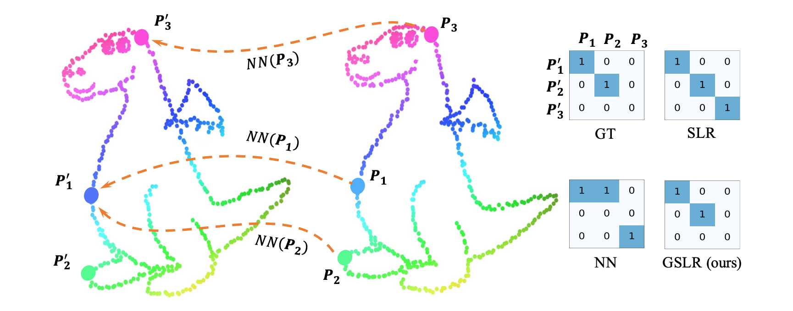

# Generalized-Shuffled-Linear-Regression

#### Code for the ICCV 2021 paper: [Generalized Shuffled Linear Regression](https://openaccess.thecvf.com/content/ICCV2021/html/Li_Generalized_Shuffled_Linear_Regression_ICCV_2021_paper.html).

##### Authors: [Feiran Li](https://sites.google.com/view/feiranlihomepage/home), [Kent Fujiwara](https://kfworks.com/), [Fumio Okura](http://cvl.ist.osaka-u.ac.jp/user/okura/), and [Yasuyuki Matsushita](http://cvl.ist.osaka-u.ac.jp/en/member/matsushita/)





**UPDATE**: The objective in Eq.7 should be corrected to . The following analysis remain the same.

### 1. Run the demo
##### For image registration and point cloud registration:
* Install necessary dependencies: ```$ pip3 install requirements.txt ```
* Run `img_registration.py` for the image registration demo, and `pcd_registration.py` for the point cloud registration one. 


##### For isometric shape matching:
* Direct to the `shape_matching` folder in Matlab. R2019a or later is needed to use the `matchpairs` function to solve the linear assignment problem.
* Run `demo.m` for fun.
* We have used the orientation-preserving operator proposed in the excellent work [BCICP](https://github.com/llorz/SGA18_orientation_BCICP_code), and this code is based on its release. Please pay attention to citation.
* If you wish to use ur own data, I have implemented a [python wrapper of the fast-marching algorithm](https://github.com/SILI1994/fast_matching_python) to compute geodesics of meshes.


### 2. Related works

##### Other implementations of shuffled linear regression:
* [Linear Regression with Shuffled Labels](https://github.com/abidlabs/shuffled_stats)
* [Stochastic Expectation-Maximization for Shuffled Linear Regression](https://github.com/abidlabs/stochastic-em-shuffled-regression)

##### Techniques for speed up:
The main limitation of our current implementation lies in time efficiency, which is dominated by the LAP solver. 
Some CUDA-based Hungarian algorithms like [this](https://github.com/rapidsai/cugraph) and [this](https://github.com/paclopes/HungarianGPU) may help to address this problem. 


### 3. Contact
Please feel free to raise an issue or email to [li.feiran@ist.osaka-u.ac.jp](li.feiran@ist.osaka-u.ac.jp) if you have any question regarding the paper or any suggestions for further improvements. 


### 4. Citation
If you find this code helpful, thanks for citing our work as
```
@inproceedings{li2021gslr,
title = {Generalized Shuffled Linear Regression},
author = {Feiran Li and Kent Fujiwara and Fumio Okura and Yasuyuki Matsushita},
booktitle = {IEEE/CVF International Conference on Computer Vision (ICCV)},
year = {2021}
}
